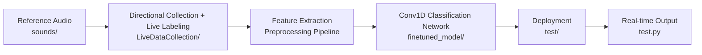

# Emergency Vehicle Direction Detection


**Complete Implementation of the Infineon Hackathon Challenge**

This project addresses the [Infineon Emergency Vehicle Direction of Arrival Hackathon](https://github.com/Infineon/hackathon) challenge: using the dual-microphone array on the PSOC™ Edge E84 AI Kit to determine in real time which of the four directions — **East, North, South, or West** — an emergency vehicle siren sound is coming from.

The repository covers the full pipeline of **data collection → model training → embedded deployment → real-time validation**, built with DEEPCRAFT™ Studio. A single command compiles and flashes the firmware; once connected, the board is ready to run. No Eclipse IDE is required.

---

## Table of Contents

- [Project Background](#project-background)
- [Project Structure](#project-structure)
- [How to Run](#how-to-run)
- [Training Steps](#training-steps)
- [Methodology and Approach](#methodology-and-approach)
  - [1. Problem Definition](#1-problem-definition)
  - [2. Overall Pipeline](#2-overall-pipeline)
  - [3. Data Collection and Labeling Strategy](#3-data-collection-and-labeling-strategy)
  - [4. Feature Engineering Design](#4-feature-engineering-design)
  - [5. Model Architecture Design](#5-model-architecture-design)
  - [6. Training Strategy and Convergence Analysis](#6-training-strategy-and-convergence-analysis)
  - [7. Experimental Results and Model Selection](#7-experimental-results-and-model-selection)
- [Innovations](#innovations)
- [Limitations and Future Improvements](#limitations-and-future-improvements)
- [Feedback](#feedback)

## Project Background

| Item | Description |
|------|-------------|
| Original Challenge | Infineon Hackathon — Emergency Vehicle Direction of Arrival |
| Hardware Platform | PSOC™ Edge E84 AI Kit (dual PDM microphones) |
| Development Tool | DEEPCRAFT™ Studio (data collection, labeling, training, export) |
| Deployment Framework | ModusToolbox™ + TensorFlow Lite for Microcontrollers |
| Classification Task | 5 classes: East / Nord / South / West / unlabeled |

This repository provides: **self-collected directional data, Conv1D model training project, on-board deployment project, and one-click flash & serial monitoring scripts**.

---

## Project Structure

The repository directory structure is as follows:


```
EESTEC_Challenge/
├── assets/                     # Experimental visualization charts (loss curves, confusion matrices, data distribution, model architecture, etc.)
├── sounds/                     # Siren/ambulance reference audio sources for playback during data collection
├── LiveDataCollection/         # DEEPCRAFT data collection project (40 directional recordings, 10 per direction; import into training project)
├── finetuned_model/            # DEEPCRAFT model training project (train after importing LiveDataCollection data)
│   └── Models/<model_name>/    #   Trained .h5 weights
│       └── Infineon/           #   Exported model.c / model.h
├── test/                       # PSOC Edge embedded deployment project (ModusToolbox tri-core structure)
│   └── proj_cm55/model/        #   model.c / model.h for flashing (replace after export from finetuned_model)
├── flash_model.sh              # One-click compile and flash to development board
├── model.py                    # DEEPCRAFT-exported Mel preprocessing pipeline (PC-side reproduction)
└── test.py                     # Serial monitoring script, displays on-board inference results in real time
```

---

## How to Run

**Environment:** ModusToolbox™ (with GCC_ARM), PSOC™ Edge E84 AI Kit, Python 3.x. Paths must not contain spaces.

### 1. Compile and Flash

```bash
chmod +x flash_model.sh
./flash_model.sh          # macOS / Linux
bash flash_model.sh       # Windows (Git Bash)
```

### 2. Monitor Inference Results

1. Set the development board BOOT SW to ON and connect USB to KitProg3
2. Modify the serial port path in `test.py` (macOS: `/dev/cu.usbmodemXXX`, Windows: `COM3`)
3. Run `python test.py`; the terminal displays direction predictions in real time:

```
Current: East      | U=0.12 E=0.87 N=0.03 S=0.01 W=0.02
```

4. Play siren audio from `sounds/` and approach the development board from different directions to test

---

## Training Steps

To retrain or fine-tune the model on top of existing data, follow this workflow:

1. **Open the training project**  
   Launch DEEPCRAFT™ Studio and open the `finetuned_model/` folder in this repository.

2. **Import labeled data**  
   Import the directional recording data from `LiveDataCollection/` that has been collected and **fully label-annotated** into the current project. This dataset contains five class labels — East / Nord / South / West / unlabeled — and requires no re-labeling.

3. **Adjust the model and train**  
   Adjust the network architecture, training parameters, and data split in Studio as needed, start training, and monitor validation metrics until the model converges.

4. **Download trained weights**  
   After training completes, download the model in Studio to obtain the `.h5` weight file (saved under `finetuned_model/Models/<model_name>/`).

5. **Export C code**  
   Run Code Generation on the `.h5` file to export `model.c` and `model.h` (located at `finetuned_model/Models/<model_name>/Infineon/`).

6. **Replace deployment files and flash**  
   Replace the `model.c` / `model.h` files under `test/proj_cm55/model/` with the exported versions, then run `./flash_model.sh` to recompile and flash, validating the new model on the development board.

---

## Methodology and Approach

### 1. Problem Definition

We formulate siren direction-of-arrival detection as a five-class classification task: in addition to the four cardinal directions, an unlabeled class distinguishes directional sirens from pure background noise. Directional information is primarily conveyed through left-right loudness differences between the dual microphones. Meanwhile, constrained by PSOC Edge CM55 INT8 quantization and low-latency requirements, feature dimensionality and network size must remain lightweight.

### 2. Overall Pipeline

Given the above constraints, we designed the following end-to-end pipeline:



### 3. Data Collection and Labeling Strategy

#### 3.1 Collection Protocol

We completed data collection under the following setup:

- **Hardware:** PSOC™ Edge E84 AI Kit, dual PDM microphone array fixed on the development board
- **Sound source:** A single speaker as the playback device; the development board position is fixed, and the speaker is placed sequentially in the East, North, South, and West directions
- **Collection method:** **10** Sessions per direction, totaling 40 directional recordings. Some Sessions were recorded at **fixed distances** (10, 20, 30, 40, 50, 60 cm, increasing in 10 cm increments); other Sessions were recorded at **variable distances**, with the experimenter freely adjusting the spacing between the speaker and the development board to cover near-field to mid-far-field distances and distance variations encountered in real-world use
- **Signal:** Play test audio from `sounds/`; each Session lasts approximately 10–30 s with multiple repeated playbacks within the segment, facilitating aligned labeling with consistent content each time
- **Tool:** DEEPCRAFT Studio `LiveDataCollection` project, PC microphone real-time recording + Live Labeling synchronous annotation

#### 3.2 Dataset Composition and Split

The dataset was split approximately 80/10/10 into training, validation, and test sets with roughly balanced sample counts. The `unlabeled` class captures ambient noise when no siren is present.

<p align="center">
  
  <br/>
  <em><strong>Figure 1.</strong> Dataset class distribution and Train / Validation / Test split (DEEPCRAFT Studio Data Explorer). The four directional classes have balanced durations (approx. 02:20–02:31), totaling 09:44 of labeled data, 11:48 including unlabeled.</em>
</p>


#### 3.3 Waveforms per Direction

The following three figures show typical Live Labeling Sessions for the East, Nord, and West directions. Each Session consists of multiple short pulses (corresponding to test tone playback) with silence between segments; the blue labeling track aligns one-to-one with energy peaks in the waveform, indicating accurate annotation.

More noteworthy is the **left-right channel difference**: the dual microphones on the board are arranged along the East-West axis. When the sound source comes from **East or West**, the microphone closer to the source shows noticeably larger waveform amplitude, with a clear high-low distinction between the two channels and strong directional features. When the sound source comes from **Nord or South**, both microphones are at similar distances from the source; the left-right waveforms are nearly synchronized with minimal amplitude difference, and directional distinguishability is noticeably weaker than for East-West — which is also one reason the model is more prone to confusion in directions such as East.

<p align="center">
  
  <br/>
  <em><strong>Figure 2.</strong> East direction: the two microphone waveforms show one high and one low, with the side closer to the source having noticeably larger amplitude; Live Labeling track annotated "East 100%".</em>
</p>

<p align="center">
  
  <br/>
  <em><strong>Figure 3.</strong> Nord direction: the two waveforms nearly overlap with comparable amplitudes, showing no obvious high-low difference (South direction behaves similarly).</em>
</p>

<p align="center">
  
  <br/>
  <em><strong>Figure 4.</strong> West direction: the two waveforms also show a clear high-low distinction, but with the opposite high-low relationship compared to East.</em>
</p>

### 4. Feature Engineering Design

Raw dual-channel waveforms cannot be fed directly into the network; they must first be converted to **Log-Mel spectrograms**. The pipeline is configured in DEEPCRAFT Studio and simultaneously exported as `model.py` (PC) and `model.c` / `model.h` (on-board), ensuring consistency between training and deployment.

1. **Frame-level sliding window:** 16 kHz dual-channel audio segmented at 512 samples/frame with 320-sample hop, yielding approximately 100 frames per second.  
2. **Spectral analysis:** Each frame is Hann-windowed and FFT-transformed; dual-microphone channels are merged to produce 257-dimensional frequency energy.  
3. **Mel compression:** Merged into 30 Mel bands (200 Hz–7 kHz), log-transformed, outputting 30-dimensional features per frame.  
4. **Feature sliding window:** 50 consecutive frames stacked to form a **50×30** matrix (approximately 0.5 s of context) as model input.

<p align="center">
  
  <br/>
  <em><strong>Figure 5.</strong> Preprocessing pipeline configuration in DEEPCRAFT Studio (corresponding to the four steps above): dual-channel 16 kHz input → frame-level sliding window → Hann window → spectral analysis → Mel filtering → logarithm → 50×30 feature output.</em>
</p>

### 5. Model Architecture Design

With input fixed as `[50, 30]` Mel features, the model must balance **recognition accuracy** against **on-board compute capacity**. We adopt DEEPCRAFT's built-in **`conv1d-small`**: only approximately 4,500 parameters, capable of real-time INT8 inference on CM55.

The network performs one-dimensional convolution along the **time axis** (50 as time, 30 as frequency), which is lighter than two-dimensional convolution. The main body consists of 4 Conv1D layers with pooling to progressively extract temporal patterns, followed by a fully connected layer outputting five-class probabilities (East / Nord / South / West / unlabeled). With limited data, BatchNorm and Dropout are added during training to suppress overfitting; global average pooling replaces a large Flatten layer at the end to further control parameter count.

<p align="center">
  
  <br/>
  <em><strong>Figure 6.</strong> conv1d-small architecture: input [50, 30] → 4 Conv1D layers → global pooling → five-class output, 4,512 parameters total.</em>
</p>

### 6. Training Strategy and Convergence Analysis

#### 6.1 Hyperparameter Configuration

We systematically compared multiple `conv1d-small` variants, with variations mainly in data balancing strategy (parameter P) and model depth. All experiments share the following base hyperparameters:

| Hyperparameter | Value | Rationale |
|----------------|-------|-----------|
| Batch Size | 4 | Small batch introduces gradient noise, aiding generalization on small datasets |
| Epochs | 10 | With early stopping (patience=20), avoids over-training |
| Learning Rate | 0.0003 | DEEPCRAFT default value, stable convergence on conv1d-small |
| Weight Decay | 0.001 | L2 regularization, suppresses overfitting on small datasets |
| Class Weights | Shared | Sample counts per class are manually balanced, no additional weighting needed |

#### 6.2 Loss Convergence Behavior

The loss curves show a healthy convergence pattern: both curves decrease together, with Validation Loss consistently below Train Loss, indicating the model is not overfitting and generalizes well on unseen data. Validation Loss reaches local minima near epochs 3, 6, and 9 (~0.36), suggesting 10 epochs is sufficient and further training yields limited benefit.

<p align="center">
  
  <br/>
  <em><strong>Figure 8.</strong> Training and validation loss curves (10 epochs). Train Loss monotonically decreases from 0.68 to 0.42; Validation Loss decreases from 0.50 to 0.36, consistently below Train Loss.</em>
</p>


#### 6.3 Accuracy Convergence Behavior

The accuracy curves further validate the above assessment: Validation Accuracy reaches ~84% around epochs 4–5 and then plateaus, while Train Accuracy continues to rise slowly (final 86.5%), with a gap of approximately 2.5%. This is typical mild overfitting on small datasets, within an acceptable range.

<p align="center">
  
  <br/>
  <em><strong>Figure 9.</strong> Training and validation accuracy curves. Train Acc rises from 74% to 86.5%; Validation Acc rises from 76% to ~84%, stabilizing after epochs 4–5.</em>
</p>


### 7. Experimental Results and Model Selection

#### 7.1 Training Set Evaluation


The model performs strongly on the training set (91.08%), with recall > 86% for all classes. The main confusion pattern is `unlabeled` being misclassified as various directions (4–6%), because background noise segments occasionally contain faint ambient sounds.

<p align="center">
  
  <br/>
  <em><strong>Figure 10.</strong> Training set confusion matrix: Accuracy = 91.08%, F1 = 91.15%. Diagonal (green) dominates; Nord (94.2%) and West (94.0%) have the highest recognition rates.</em>
</p>


#### 7.2 Test Set Evaluation

Test set accuracy is 82.50%, lower than the training set's 91.08%, which is normal for a small dataset. Three main findings:

- **West is easiest to recognize (87.3%):** When the sound source is on the West side, the dual microphones show the most pronounced "one high, one low" pattern, making it easiest for the model to classify.
- **East is most prone to errors (74.5%):** Often confused with "no siren" background or West — the East and West sides sound too similar, and the model sometimes fails to distinguish them.
- **Nord / South are in the middle (~84%):** Both microphones receive similar sound levels, with stable performance and no particularly prominent misclassifications.

<p align="center">
  
  <br/>
  <em><strong>Figure 11.</strong> Test set confusion matrix: Accuracy = 82.50%, F1 = 83.50%. West (87.3%) performs best; East (74.5%) is the main weak direction.</em>
</p>


---

## Innovations

### 1. Script-Automated Compile and Flash Without Eclipse

Official documentation typically requires importing the project through the Eclipse ModusToolbox™ IDE and clicking Build and Program to compile and flash. After examining the source repository, we found that the `test/` directory already contains ModusToolbox's native command-line build system, with the following core files:

- **`test/Makefile`** — Top-level Application Makefile (`MTB_TYPE=APPLICATION`), defining tri-core sub-projects `proj_cm33_s`, `proj_cm33_ns`, `proj_cm55`, and importing ModusToolbox's `application.mk`
- **`test/common.mk`** — Shared configuration for sub-projects, specifying target board `TARGET=APP_KIT_PSE84_AI`, toolchain `TOOLCHAIN=GCC_ARM`, inference core `ML_DEEPCRAFT_CPU=cm55`, etc.
- **`test/common_app.mk`** — Application-level path and dependency configuration

This means Eclipse is not required — running `make build` and `make program` directly in the terminal provides the same compilation and flashing as the IDE.

Based on this, we wrote the **`flash_model.sh`** script in the root directory. Running the following command completes compilation and flashing:

```bash
./flash_model.sh
```

### 2. Python Toolchain

Beyond DEEPCRAFT™ Studio's GUI workflow, we supplemented two lightweight Python scripts on the PC side for **feature debugging** and **on-board validation**, forming a complete closed loop of "train → export → flash → monitor" without needing additional serial debugging tools or manual firmware log parsing.

#### `model.py` — PC-Side Reproduction

`model.py` is generated synchronously by DEEPCRAFT Studio during model export, maintaining the same parameters and operator order as the on-board preprocessing code. Its main uses:

- **Alignment verification:** Run feature extraction with NumPy on PC to confirm consistency with the Studio training phase.
- **Offline debugging:** Test preprocessing output shape and value range on arbitrary dual-channel audio segments without connecting the development board.
- **Rapid experimentation:** Try new physical features or data augmentation on the Python side; iterate on `model.py` first, then write back to the DEEPCRAFT project.

#### `test.py` — Real-Time Serial Monitoring

The on-board firmware continuously outputs inference logs. `test.py` directly monitors this serial stream, parses the five-class scores, and displays them with single-line refresh in the terminal, for example:

```
Current: East      | U=0.12 E=0.87 N=0.03 S=0.01 W=0.02
```

Usage:
1. After flashing the development board, connect USB to KitProg3 and confirm the serial device name (the `PORT` variable at the top of the script; macOS: `/dev/cu.usbmodemXXX`, Windows: `COMx`)
2. Run `python test.py`
3. Play siren audio from `sounds/` or test in real conditions; the terminal provides **plug-and-play** observation of direction predictions and per-class confidence scores without opening other software.

---

## Limitations and Future Improvements

During the project, we identified the following **hardware and algorithm-level limitations**, along with corresponding **potential improvement directions**:

1. **Dual-microphone array and directional ambiguity**
   - The PSOC Edge E84 AI Kit has only two on-board microphones with limited information dimensionality; dual-channel waveforms are similar in the front-back directions.
   - Can be extended to a **4-microphone array** (e.g., one on each side), covering 360° directions and introducing phase differences in vertical or front-back dimensions.

2. **Microphone spacing, board form factor, and physical prior embedding**
   - The current model does not explicitly leverage physical parameters such as microphone spacing and PCB dimensions; feature extraction is predominantly data-driven.
   - Inject **microphone spacing, speed of sound, sample rate, microphone coordinates**, etc. as priors into features or network architecture; fuse physics-based estimates at the feature layer and impose physical consistency constraints on predictions beyond array resolution.

3. **Data augmentation and scene coverage**
   - To support **more directions or finer-grained angles** (e.g., 8 directions), classification boundaries become more complex, requiring **larger-scale, more precisely labeled directional data**.
   - Increase sample collection for easily confused directions (e.g., East / West) and boundary angles.
   - Introduce more **data augmentation**: reverb, background noise overlay, varying playback distance and angle fine-tuning.
   - Train with more real siren recordings to improve real-world robustness.

4. **Toolchain**
   - While retaining DEEPCRAFT deployment advantages, use the Python side for model search and physical feature experiments, then export the optimal architecture to Studio.

---

## Feedback

The following reflects our team's overall impressions and takeaways from this project:

This was a very worthwhile and interesting challenge. The Challenge was very well organized, providing participants with abundant food and necessary competition supplies. As students with Informatics and Mathematics backgrounds, we had no prior experience to embedded development and were all going through it hands-on for the first time. The entire process was very challenging but also gave us a more concrete understanding of real-world embedded AI deployment.

**Onboarding barrier:** The installation and environment setup of ModusToolbox, DEEPCRAFT Studio, and other software consumed a significant amount of time. If the Hackathon organizers or future participants could provide more detailed installation steps, onboarding would be much faster.

**Tool experience:** DEEPCRAFT Studio is very user-friendly for data collection and one-click deployment, but for neural network architecture fine-tuning and experimental iteration, it is less flexible than writing code directly in Python (PyTorch / TensorFlow). Students accustomed to code-driven ML workflows need some time to adapt to its GUI workflow.

**Summary:** Despite the somewhat time-consuming initial setup, overall this was a very worthwhile and rewarding challenge. We completed a full embedded AI project from scratch, gained deep understanding of the Infineon ecosystem and embedded AI, and recommend it to students participating in similar Hackathons in the future.

---
