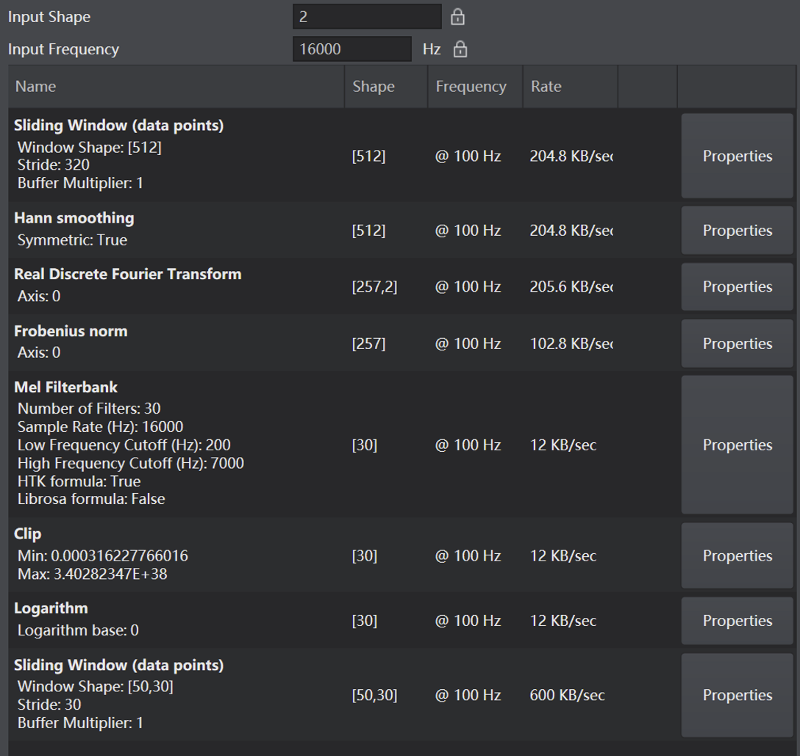
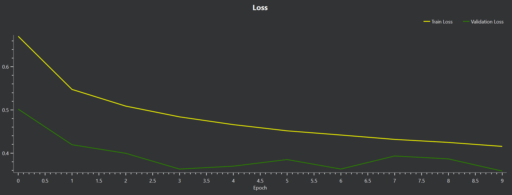
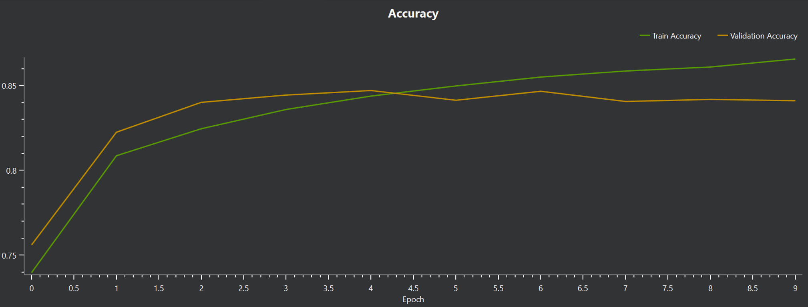

# Emergency Vehicle Direction Detection


**Infineon Hackathon Challenge 完整实现**

本项目对应 [Infineon Emergency Vehicle Direction of Arrival Hackathon](https://github.com/Infineon/hackathon) 赛题：使用 PSOC™ Edge E84 AI Kit 的双麦克风阵列，实时判断紧急车辆（警笛/救护车）声源来自 **East（东）、Nord（北）、South（南）、West（西）** 四个方向中的哪一个。

仓库自包含 **数据采集 → 模型训练 → 嵌入式部署 → 实时验证** 全流程，基于 DEEPCRAFT™ Studio 与 ModusToolbox™ 完成。无需打开 Eclipse IDE，一条命令即可编译烧录，接上开发板即可运行。

---

## 目录

- [项目背景](#项目背景)
- [项目结构](#项目结构)
- [运行方式](#运行方式)
- [训练步骤](#训练步骤)
- [方法与思路](#方法与思路)
  - [1. 问题定义](#1-问题定义)
  - [2. 总体方案](#2-总体方案)
  - [3. 数据采集与标注策略](#3-数据采集与标注策略)
  - [4. 特征工程设计](#4-特征工程设计)
  - [5. 模型架构设计](#5-模型架构设计)
  - [6. 训练策略与收敛分析](#6-训练策略与收敛分析)
  - [7. 实验结果与模型选择](#7-实验结果与模型选择)
- [创新点](#创新点)
- [限制与提升点](#限制与提升点)
- [反馈](#反馈)

## 项目背景

| 项目 | 说明 |
|------|------|
| 原始挑战 | Infineon Hackathon — Emergency Vehicle Direction of Arrival |
| 硬件平台 | PSOC™ Edge E84 AI Kit（双 PDM 麦克风） |
| 开发工具 | DEEPCRAFT™ Studio（数据采集、标注、训练、导出） |
| 部署框架 | ModusToolbox™ + TensorFlow Lite for Microcontrollers |
| 分类任务 | 5 类：East / Nord / South / West / unlabeled |

本仓库提供：**自采集定向数据、Conv1D 模型训练工程、板端部署工程，以及一键烧录与串口监听脚本**。

---

## 项目结构

本仓库目录结构如下：

```
EESTEC_Challenge/
├── assets/                     # 实验可视化图表（损失曲线、混淆矩阵、数据分布、模型结构等）
├── sounds/                     # 警笛/救护车参考音源，用于数据采集时播放
├── LiveDataCollection/         # DEEPCRAFT 数据采集工程（40 条定向录音，每方向 10 条，需导入训练工程）
├── finetuned_model/            # DEEPCRAFT 模型训练工程（导入 LiveDataCollection 数据后训练）
│   └── Models/<模型名>/        #   训练产出的 .h5 权重
│       └── Infineon/           #   导出 model.c / model.h
├── test/                       # PSOC Edge 嵌入式部署工程（ModusToolbox 三核结构）
│   └── proj_cm55/model/        #   烧录用 model.c / model.h（由 finetuned_model 导出后替换）
├── flash_model.sh              # 一键编译并烧录到开发板
├── model.py                    # DEEPCRAFT 导出的 Mel 预处理管线（PC 端复现）
└── test.py                     # 串口监听脚本，实时显示板端推理结果
```

---

## 运行方式

**环境：** ModusToolbox™（含 GCC_ARM）、PSOC™ Edge E84 AI Kit、Python 3.x。路径中不要有空格。

### 1. 编译并烧录

```bash
chmod +x flash_model.sh
./flash_model.sh          # macOS / Linux
bash flash_model.sh       # Windows (Git Bash)
```

需已安装 ModusToolbox™ 并配置 `CY_TOOLS_DIR`。实现原理见 [创新点](#创新点)。

### 2. 监听推理结果

1. 开发板 BOOT SW 拨至 ON，USB 连接 KitProg3
2. 修改 `test.py` 中的串口路径（macOS: `/dev/cu.usbmodemXXX`，Windows: `COM3`）
3. 运行 `python test.py`，终端实时显示方向预测：

```
Current: East      | U=0.12 E=0.87 N=0.03 S=0.01 W=0.02
```

4. 播放 `sounds/` 中的警笛音源，从不同方向靠近开发板即可测试

---

## 训练步骤

如需在已有数据基础上重新训练或微调模型，按以下流程操作：

1. **打开训练工程**  
   启动 DEEPCRAFT™ Studio，打开本仓库中的 `finetuned_model/` 文件夹。

2. **导入标注数据**  
   将 `LiveDataCollection/` 中已采集、**已完成 Label 标注** 的定向录音数据导入当前工程。该数据集包含 East / Nord / South / West / unlabeled 五类标签，无需重新标注。

3. **调整模型并训练**  
   在 Studio 中按需调整网络结构、训练参数与数据划分，启动训练并观察验证集指标，直至模型收敛。

4. **下载训练权重**  
   训练完成后，在 Studio 中下载模型，获得 `.h5` 权重文件（保存在 `finetuned_model/Models/<模型名>/` 下）。

5. **导出 C 代码**  
   基于 `.h5` 文件执行代码生成（Code Generation），导出 `model.c` 与 `model.h`（位于 `finetuned_model/Models/<模型名>/Infineon/`）。

6. **替换部署文件并烧录**  
   将导出的 `model.c` / `model.h` 替换 `test/proj_cm55/model/` 下的同名文件，然后执行 `./flash_model.sh` 重新编译烧录，即可在开发板上验证新模型。

---

## 方法与思路

### 1. 问题定义

我们将警笛声源方向判断形式化为五分类任务：在四方位之外增设 unlabeled 类，以区分有方向性警笛与纯背景噪声；方位信息主要靠双麦左右响度差体现。同时受 PSOC Edge CM55 INT8 量化与低延迟约束，特征维度与网络规模须保持轻量。

### 2. 总体方案

基于上述约束，我们设计了如下端到端流水线：


### 3. 数据采集与标注策略

#### 3.1 采集协议

我们在以下环境完成数据采集：

- **硬件：** PSOC™ Edge E84 AI Kit，双 PDM 麦克风阵列固定于开发板
- **声源：** 单一扬声器作为播放端，开发板位置固定，扬声器依次置于东、北、南、西四个方向
- **采集方法：** 每方向采集 **10 组** Session，合计 40 条定向录音。其中部分 Session 在 **固定距离** 下完成（10、20、30、40、50、60 cm，按 10 cm 递增）；另有部分 Session 在 **不固定距离** 下采集，由实验者自由调整扬声器与开发板间距，以覆盖近场至中远场及实际使用中的距离波动
- **信号：** 播放 `sounds/` 中的测试音频，每段 Session 持续约 10–30 s，段内多次重复播放，便于对齐标注且每次内容一致。
- **工具：** DEEPCRAFT Studio `LiveDataCollection` 工程，PC 麦克风实时录音 + Live Labeling 同步标注

#### 3.2 数据集构成与划分

按近似 80/10/10 划分为训练集、验证集和测试集，样本量基本均衡。`unlabeled` 类用于捕获无警笛时的环境噪声。

<p align="center">
  
  <br/>
  <em><strong>Figure 1.</strong> 数据集类别分布与 Train / Validation / Test 划分（DEEPCRAFT Studio Data Explorer）。四个方向类时长均衡（约 02:20–02:31），合计标注数据 09:44，含 unlabeled 共 11:48。</em>
</p>


#### 3.3 各方向采集波形

以下三图展示了 East、Nord、West 方向的典型 Live Labeling Session。每个 Session 由多段短促脉冲组成（对应测试音播放），段间为静音；蓝色标注轨道与波形中的能量峰值一一对齐，说明标注准确。

更值得关注的是 **左右声道差异**：开发板双麦沿东西轴向排布，当声源来自 **East 或 West** 时，靠近声源一侧的麦克风波形振幅明显更大，两路通道高低分明，方向特征清晰；而当声源来自 **Nord 或 South** 时，两路麦克风到声源距离相近，左右波形几乎同步、幅度差异很小，方向辨识度明显弱于东西向——这也是后续模型在 East 等方向更易混淆的原因之一。

<p align="center">
  
  <br/>
  <em><strong>Figure 2.</strong> East 方向：两路麦克风波形一高一低，靠近声源一侧振幅明显更大；Live Labeling 轨道标注 "East 100%"。</em>
</p>

<p align="center">
  
  <br/>
  <em><strong>Figure 3.</strong> Nord 方向：两路波形几乎重叠、幅度相当，看不出明显高低差（South 方向表现类似）。</em>
</p>

<p align="center">
  
  <br/>
  <em><strong>Figure 4.</strong> West 方向：两路波形同样高低分明，但与 East 呈相反的高低关系。</em>
</p>

### 4. 特征工程设计

双通道原始波形无法直接输入网络，需先转为 **Log-Mel 频谱图**。流程在 DEEPCRAFT Studio 配置，并同步导出为 `model.py`（PC）与 `model.c` / `model.h`（板端），保证训练与部署一致。

1. **帧级滑窗：** 16 kHz 双通道音频按 512 点/帧、320 点步长切分，约每秒 100 帧。  
2. **频谱分析：** 每帧加 Hann 窗后做 FFT，合并双麦通道，得到 257 维频率能量。  
3. **Mel 压缩：** 合并为 30 个 Mel 频带（200 Hz–7 kHz），取对数，每帧输出 30 维特征。  
4. **特征滑窗：** 连续堆叠 50 帧，得到 **50×30** 矩阵（约 0.5 s 上下文），作为模型输入。

<p align="center">
  
  <br/>
  <em><strong>Figure 5.</strong> DEEPCRAFT Studio 中的预处理管线配置（与上文四步对应）：双通道 16 kHz 输入 → 帧级滑窗 → Hann 窗 → 频谱分析 → Mel 滤波 → 取对数 → 50×30 特征输出。</em>
</p>

### 5. 模型架构设计

输入固定为 `[50, 30]` 的 Mel 特征后，模型需在 **识别精度** 与 **开发板算力** 之间取舍。我们采用 DEEPCRAFT 内置的 **`conv1d-small`**：仅约 4,500 参数，可在 CM55 上以 INT8 实时推理。

网络沿 **时间轴** 做一维卷积（50 为时间、30 为频率），比二维卷积更轻量。主体为 4 层 Conv1D，配合池化逐步提取时序模式，最后经全连接层输出五类概率（East / Nord / South / West / unlabeled）。数据量有限，训练中加入 BatchNorm 与 Dropout 抑制过拟合；末端用全局平均池化代替大 Flatten 层，进一步控制参数量。

<p align="center">
  
  <br/>
  <em><strong>Figure 6.</strong> conv1d-small 结构：输入 [50, 30] → 4 层 Conv1D → 全局池化 → 五分类输出，共 4,512 参数。</em>
</p>

### 6. 训练策略与收敛分析

#### 6.1 超参数配置

我们系统性地对比了多个 `conv1d-small` 变体，主要变化维度为数据平衡策略（参数 P）和模型深度。所有实验共享以下基础超参数：

<p align="center">
  
  <br/>
  <em><strong>Figure 7.</strong> 训练超参数配置：Batch Size = 4, Split Count = 16, 4 组 conv1d-small 实验（P = 35/45/67/89），Epochs = 10, LR = 0.0003, Weight Decay = 0.001。</em>
</p>

| 超参数 | 值 | 选择理由 |
|--------|-----|----------|
| Batch Size | 4 | 小 batch 引入梯度噪声，有助于小数据集泛化 |
| Epochs | 10 | 配合 Patience=20 的 early stopping，避免过度训练 |
| Learning Rate | 0.0003 | DEEPCRAFT 默认值，在 conv1d-small 上收敛稳定 |
| Weight Decay | 0.001 | L2 正则化，抑制小数据集过拟合 |
| Class Weights | Shared | 各类别样本量已人工均衡，无需额外加权 |

#### 6.2 Loss 收敛行为

Loss 曲线呈现健康的收敛模式：两条曲线同步下降，Validation Loss 始终低于 Train Loss，说明模型没有过拟合，且在未见数据上泛化良好。Validation Loss 在 epoch 3、6、9 附近出现局部极小值（~0.36），暗示 10 epoch 已足够，继续训练收益有限。

<p align="center">
  
  <br/>
  <em><strong>Figure 8.</strong> 训练与验证 Loss 曲线（10 epochs）。Train Loss 从 0.68 单调降至 0.42；Validation Loss 从 0.50 降至 0.36，且始终低于 Train Loss。</em>
</p>


#### 6.3 Accuracy 收敛行为

Accuracy 曲线进一步验证了上述判断：Validation Accuracy 在 epoch 4–5 达到 ~84% 后进入平台期，而 Train Accuracy 仍缓慢上升（最终 86.5%），两者差距约 2.5%。这是小数据集上的典型轻微过拟合，在可接受范围内。

<p align="center">
  
  <br/>
  <em><strong>Figure 9.</strong> 训练与验证 Accuracy 曲线。Train Acc 从 74% 升至 86.5%；Validation Acc 从 76% 升至 ~84%，epoch 4–5 后趋于稳定。</em>
</p>


### 7. 实验结果与模型选择

#### 7.1 训练集评估


训练集上模型表现强劲（91.08%），各类别召回率均 > 86%。主要混淆模式为 `unlabeled` 被误判为各方向（4–6%），这是因为背景噪声段中偶尔含有微弱的环境声。

<p align="center">
  
  <br/>
  <em><strong>Figure 10.</strong> 训练集混淆矩阵：Accuracy = 91.08%, F1 = 91.15%。对角线（绿色）为主，Nord (94.2%) 和 West (94.0%) 识别率最高。</em>
</p>


#### 7.2 测试集评估

测试集准确率 82.50%，低于训练集 91.08%，在小体量数据集上属于正常现象。三个主要发现：

- **West 最好认（87.3%）：** 声源在西侧时，两路麦克风「一高一低」最明显，模型最容易判断。
- **East 最容易错（74.5%）：** 常和「无警笛」背景或 West 搞混——东西两侧听起来太像，模型有时分不清。
- **Nord / South 居中（约 84%）：** 两侧麦克风收到的声音差不多，表现稳定，没有特别突出的误判。

<p align="center">
  
  <br/>
  <em><strong>Figure 11.</strong> 测试集混淆矩阵：Accuracy = 82.50%, F1 = 83.50%。West (87.3%) 表现最好；East (74.5%) 为主要薄弱方向。</em>
</p>


#### 7.3 最终模型选择

综合训练曲线（Figure 8–9）与训练集/测试集混淆矩阵（Figure 10–11），选定 `finetuned_model/` 中训练得到的 **`conv1d-small`** 变体，导出 `model.c` / `model.h` 部署至 `test/proj_cm55/model/`。该模型测试集准确率 82.50%，满足 CM55 INT8 实时推理约束，并已在板端 UART 输出中验证可用。

---

## 创新点

### 1. 不使用 Eclipse，运用脚本自动化编译烧录

官方文档默认通过 Eclipse ModusToolbox™ IDE 导入工程、点击 Build 和 Program 完成编译烧录。通过仔细观察源代码库，我们发现 `test/` 目录下已包含 ModusToolbox 原生的命令行构建体系，核心文件如下：

- **`test/Makefile`** — 顶层 Application Makefile（`MTB_TYPE=APPLICATION`），定义三核子工程 `proj_cm33_s`、`proj_cm33_ns`、`proj_cm55`，并引入 ModusToolbox 的 `application.mk`
- **`test/common.mk`** — 各子工程共享的配置，指定目标板 `TARGET=APP_KIT_PSE84_AI`、工具链 `TOOLCHAIN=GCC_ARM`、推理核心 `ML_DEEPCRAFT_CPU=cm55` 等
- **`test/common_app.mk`** — 应用级路径与依赖配置

这意味着无需打开 Eclipse，直接在终端执行 `make build` 和 `make program` 即可完成与 IDE 等价的编译与烧录。

基于此，我们编写了根目录下的 **`flash_model.sh`** 脚本。通过运行以下指令即可完成编译与烧录：

```bash
./flash_model.sh
```

### 2. Python 工具链

除 DEEPCRAFT™ Studio 的 GUI 工作流外，我们在 PC 端补充了两个轻量 Python 脚本，分别覆盖 **特征调试** 与 **板端验证** 两个环节，形成「训练 → 导出 → 烧录 → 监听」的完整闭环，无需额外安装串口调试工具或自行解析固件日志。

#### `model.py` — PC 端复现

`model.py` 由 DEEPCRAFT Studio 在导出模型时同步生成，与板端预处理代码保持同一套参数与算子顺序。其主要用途：

- **对齐验证：** 在 PC 上用 NumPy 跑通特征提取，确认与 Studio 训练阶段一致。
- **离线调试：** 无需连接开发板，即可对任意双通道音频片段测试预处理输出形状与数值范围
- **快速实验：** 可在 Python 侧尝试新的物理特征或数据增强，可先在 `model.py` 基础上迭代，再回写 DEEPCRAFT 工程

#### `test.py` — 串口实时监听

板端固件持续输出推理日志。`test.py` 直接监听该串口流，解析五类分数并在终端单行刷新显示，例如：

```
Current: East      | U=0.12 E=0.87 N=0.03 S=0.01 W=0.02
```

使用方式：
1. 开发板烧录完成后，USB 连接 KitProg3，确认串口设备名（脚本顶部 `PORT` 变量，macOS 为 `/dev/cu.usbmodemXXX`，Windows 为 `COMx`）
2. 运行 `python test.py`
3. 播放 `sounds/` 中警笛音源或实机测试，终端即可 **即插即用** 地观察方向预测与各类置信度，无需打开其他软件。

---

## 限制与提升点

在完成项目的过程中，我们识别出以下 **硬件与算法层面的限制**，以及对应的 **潜在改进方向**：

1. **双麦克风阵列与方向歧义**
   - PSOC Edge E84 AI Kit 仅板载双麦克风，信息维度有限；前后方向上双通道波形相近。
   - 可扩展为 **4 麦克风阵列**（如四边各一），覆盖 360° 方向，并引入垂直或前后维度的相位差。

2. **麦距、板型与物理先验嵌入**
   - 当前模型未显式利用麦克风间距、PCB 尺寸等物理参数，特征提取偏数据驱动
   - 将 **麦距、声速、采样率、麦克风坐标** 等作为先验注入特征或网络结构；在特征层融合基于物理量的估计，并对超出阵列分辨率的预测施加物理一致性约束

3. **数据扩充与场景覆盖**
   - 若需支持 **更多方向或更细粒度角度**（如8方向），分类边界更复杂，需要 **更大规模、更精确的定向标注数据**
   - 增大易混淆方向（如 East / West）及边界角度样本采集量
   - 引入更多 **数据增强**：混响、背景噪声叠加、不同播放距离与角度微调
   - 采用更多真实警笛录音训练，提升实际场景鲁棒性

4. **工具链**
   - 保留 DEEPCRAFT 部署优势的同时，用 Python 侧做模型搜索与物理特征实验，再导出最优结构至 Studio

---

## 反馈

以下为我们小组对本项目的整体感受与体会：

这是一次非常值得参与、也很有意思的挑战。本次Challenge的组织非常棒，为选手提供了丰富的食物以及必要的参赛物品。作为 **Informatics 与 Mathematics 背景** 的同学，我们此前几乎没有接触过嵌入式（Embedded）开发，都是第一次亲手走通。整个过程非常锻炼人，也让我们对嵌入式AI的实际落地有了更具体的认识。

**上手门槛：** 前期 **ModusToolbox、DEEPCRAFT Studio 等软件的安装与环境调试** 占用了较多时间。如果 Hackathon 官方或后续参与者能提供更细致的安装步骤，上手速度会快很多。

**工具体验：** DEEPCRAFT Studio 在数据采集和一键部署方面非常友好，但在 **神经网络结构微调与实验迭代** 上，不如直接用 Python（PyTorch / TensorFlow）写代码来得灵活。对于习惯代码驱动 ML 流程的同学，需要一定时间适应其 GUI 工作流。

**总结：** 尽管前期 setup 略为耗时，但总体而言这是一次 **非常值得、收获满满** 的挑战。我们从零完成了一次完整的嵌入式AI的项目，对 Infineon 生态和嵌入式 AI 有了深入理解，也推荐给后续参加类似 Hackathon 的同学。

---
